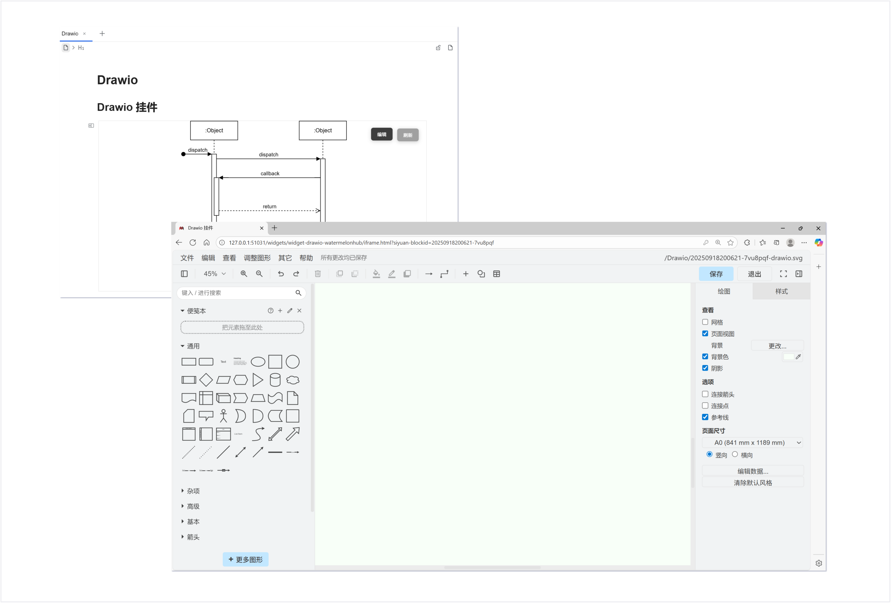

# widget-drawio-watermelonhub

## 介绍

这是一个类似于ooooooook开发excalidraw模式的drawio的挂件，文档中只预览而不编辑，点击编辑即可在浏览器进行编辑。

*作者比较喜欢这种方式进行图片编辑，不至于让文档非常杂乱，并且在浏览器编辑操作更方便。ooooooook开发的excalidraw作者一直在用，但是excalidraw功能不够丰富，于是想着开发drawio的挂件。*

## 用法

1. 挂件选择drawio-watermelonhub
2. 点击编辑按钮打开浏览器进行drawio的编辑
3. drawio在你每次进行操作后自动保存，也可手动点击右上角保存
4. 之后回到文档，点击刷新按钮，刷新图像

## 更新

### v0.1.2

1. 修复siyuan认证问题
2. 优化细节
3. 增加README

### v0.1.1

1. 删除无用文件，缩小体积
2. 删除日志打印

### v0.1.0

1. 修复资源未引用问题
2. 优化细节

‍

## 感谢

- [drawio](https://github.com/jgraph/drawio)
- [siyuan](https://github.com/siyuan-note/siyuan)
- [ooooooook/widget-excalidraw](https://github.com/ooooooook/widget-excalidraw)

## 激励
如果觉得能帮到您，您可以给我个star，或者可以请我吃块西瓜，谢谢！您的鼓励是我最大的动力！

